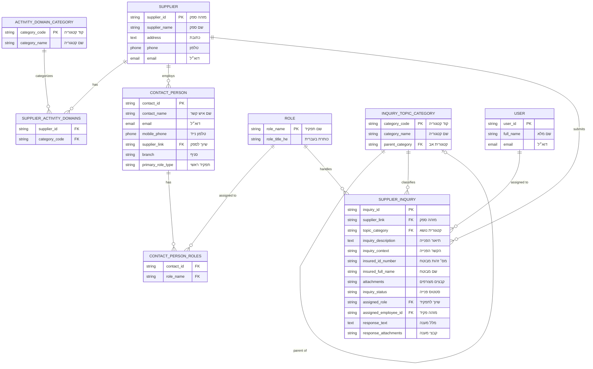

# ERD Diagram - Supplier Inquiry Management System

Entity Relationship Diagram based on the DocType specification for the Nursing Management System POC.

## Entity Descriptions

### Core Entities

1. **Supplier (ספק)**
   - Primary entity representing service providers
   - Has multiple activity domains and contact persons
   - Submits inquiries to the system

2. **Contact Person (איש קשר)**
   - Portal users associated with suppliers
   - Can have multiple roles
   - Links to specific supplier and branch

3. **Role (תפקיד)**
   - Functional roles for inquiry handling
   - Examples: שירות, טיפול בתלונות, טיפול חשבונות שוטפים

4. **Activity Domain Category (קטגוריות תחומי פעילות)**
   - Categories defining supplier's areas of operation
   - Many-to-many relationship with suppliers

5. **Inquiry Topic Category (קטגוריות נושאי פנייה)**
   - Hierarchical classification (2 levels)
   - Self-referential for parent-child relationship

6. **Supplier Inquiry (פניית ספק)**
   - Main transactional entity
   - Tracks inquiry lifecycle, assignment, and responses
   - Links to supplier, topic category, role, and employee

7. **User (משתמש מערכת)**
   - Frappe built-in entity
   - Represents internal employees handling inquiries

## Relationship Summary

- **One-to-Many**: Supplier→Contact Person, Supplier→Inquiry, Role→Inquiry, User→Inquiry
- **Many-to-Many**: Supplier↔Activity Domain (via child table), Contact Person↔Role (via child table)
- **Self-Referential**: Inquiry Topic Category (parent-child hierarchy)
- **Lookup**: Inquiry→Topic Category, Inquiry→Supplier, Inquiry→Role, Inquiry→User

## Notes

- Child tables (SUPPLIER_ACTIVITY_DOMAINS, CONTACT_PERSON_ROLES) represent many-to-many relationships
- All field labels shown in Hebrew as per system requirements
- PK = Primary Key, FK = Foreign Key
- Inquiry context can be "ספק עצמו" or "מבוטח"
