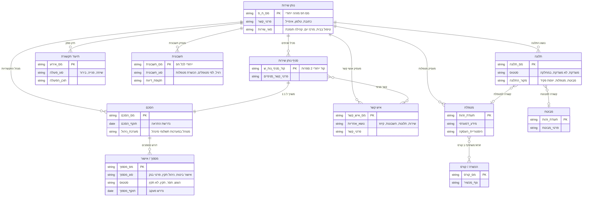

```mermaid
erDiagram
    
    "נותן שירות" ||--o{ "סניף נותן שירות" : "מכיל סניפים"
    "נותן שירות" ||--o{ "הסכם" : "מנהל התקשרויות"
    "נותן שירות" ||--o{ "איש קשר" : "מעסיק אנשי קשר"
    "נותן שירות" ||--o{ "תיעוד תקשורת" : "תיק ספק"
    "נותן שירות" ||--o{ "חשבונית" : "מנפיק חשבונית"
    "נותן שירות" ||--o{ "תלונה" : "נושא התלונה"
    "נותן שירות" ||--o{ "מטפלת" : "מעסיק מטפלות"

    "סניף נותן שירות" ||--|| "הסכם" : "משויך ל 1:1"
    "סניף נותן שירות" o{--o{ "איש קשר" : "קשר סניפי"

    "הסכם" ||--o{ "מסמך / אישור" : "דורש מסמכים"

    "תלונה" o{--o| "מטפלת" : "קשורה למטפלת"
    "תלונה" o{--o| "מבוטח" : "קשורה למבוטח"

    "מטפלת" }o--o{ "הכשרה / קורס" : "משתתף ב קורס M:M"


    "נותן שירות" {
        string מס_ח_פ PK "מס חפ מזהה ייחודי"
        string פרטי_קשר "כתובת, טלפון, אימייל"
        string סוגי_שירות "טיפול בבית, מרכז יום, קהילה תומכת"
    }

    "סניף נותן שירות" {
        string קוד_סניף_נות_ש PK "קוד ייחודי 2 ספרות"
        string פרטי_קשר_סניפיים
    }

    "הסכם" {
        string מס_הסכם PK
        date תוקף_הסכם "נדרשת התראה"
        string מערכת_ניהול "מנוהל במערכות תשלומי מינהל"
    }

    "מסמך / אישור" {
        string מס_מסמך PK
        string סוג_מסמך "אישור ביטוח, ניהול תקין, פרטי בנק"
        string סטטוס "הוגש, חסר, תקין, לא תקין"
        date תוקף_מסמך "נדרש מעקב"
    }

    "איש קשר" {
        string מס_איש_קשר PK
        string נושא_אחריות "שירות, תלונות, חשבונות, קיזוז"
        string פרטי_קשר
    }

    "תיעוד תקשורת" {
        string מס_אירוע PK
        string סוג_פעולה "שיחה, פנייה, בירור"
        string תוכן_הפעולה
    }

    "תלונה" {
        string מס_תלונה PK
        string סטטוס "מוצדקת, לא מוצדקת, במחלקה"
        string מקור_התלונה "מבוטח, מטפלות, יוזמת פקיד"
    }

    "חשבונית" {
        string מס_חשבונית PK "ייחודי לכל חפ"
        string סוג_חשבונית "רגיל, לפי מטופלים, הכשרת מטפלות"
        string תקופת_דיווח
    }

    "מטפלת" {
        string תעודת_זהות PK
        string מידע_דמוגרפי
        string היסטוריית_העסקה
    }

    "הכשרה / קורס" {
        string מס_קורס PK
        string גוף_מכשיר
    }

    "מבוטח" {
        string תעודת_זהות PK
        string פרטי_מבוטח
    }
```